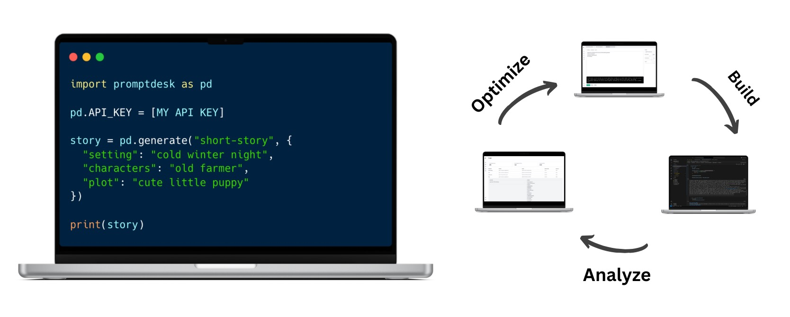

[](https://www.gnu.org/licenses/agpl-3.0)
[](https://hub.docker.com/r/promptdesk/promptdesk)
[](https://badge.fury.io/py/promptdesk)

## What is PromptDesk?

PromptDesk is 100% free and open-source tool designed to facilitate the creation, organization, integration, and evaluation of prompts, prompt-based applications and Large Language Models (LLMs).



#### PrompDesk Python PIP Package

The PrompDesk Python PIP Package is an ultra-lightweight library to call and process prompts remotely or locally.
- Generate: Call prompts remotely or locally.
- JSON: Convert prompts to JSON format.
- Variables: Add variables to prompts.
- Data validation: Validate prompt data.

#### PrompDesk GUI

The PromptDesk GUI is an OpenAI playground clone that makes it easy to build and organize prompt-based applications.
- Workspace: Build and test completion, code and chat prompts with variables.
- Prompts: Create and organize prompts.
- Models: Create, edit, test and add unlimited LLM models.
- Logs: View, analyze and export prompt calls.
- Settings: Configure variables and API keys.

We recommend starting with the [Quickstart](https://promptdesk.ai/docs/quickstart) guide. You can also jump straight to the [Build Prompts](https://promptdesk.ai/docs/building-prompts/) or start integrating prompts in python with [Integrate Prompts](https://promptdesk.ai/docs/python-sdk/) guides.

## Quickstart

### Install PromptDesk

To install PromptDesk, use pip:

```python
pip install promptdesk
```

### Usage

You can call the prompt you build in the application by using the generate method.

```python
from promptdesk import PromptDesk

pd = PromptDesk(
    #defaults to os.environ.get("PROMPTDESK_API_KEY")
    api_key = "YOUR_PROMPTDESK_API_KEY"
)

story = pd.generate("short-story", {
    "setting": "dark and stormy night",
    "character": "lonely farmer",
    "plot": "visited by a stranger"
})

print(story)
```

You can find your API key in the application under Organization Information > API Key.

### Troubleshooting

#### Testing the Service

You can test the service endpoint by pinging it:

```python
print(pd.ping())
```

A successful ping will return "pong".

#### Prompt name

The prompt name you use in the generate method must match the name of the prompt you created in the application.

#### Logs

You can view the logs of your prompt calls in the application. If you are having trouble, check the logs to see if there are any errors.

## Important Links
- [Documentation](https://promptdesk.ai/docs/)
- [GitHub - Application](https://github.com/promptdesk/promptdesk)
- [GitHub - Python PIP](https://github.com/promptdesk/promptdesk-py)
- [Docker Hub](https://hub.docker.com/r/promptdesk/promptdesk)